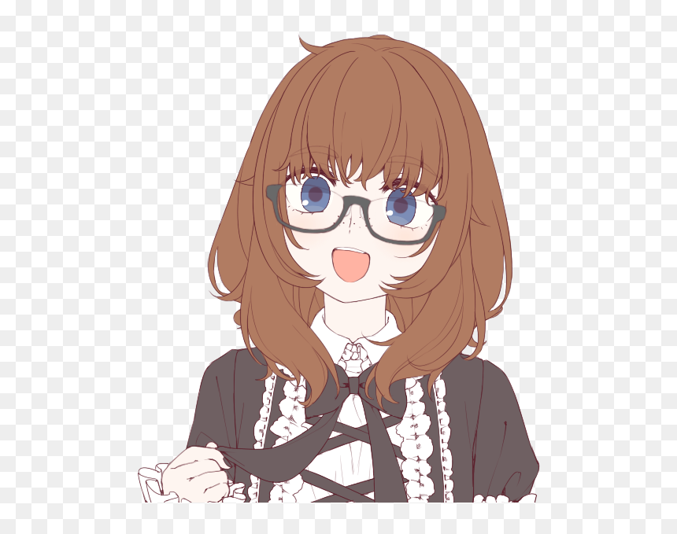

> 🚧 **PROJECT IS NOT COMPLETE YET** 🚧

# UWU Companion

UWU is an interactive, AI-powered desktop companion designed to boost your productivity, keep you motivated, and bring a bit of joy to your daily workflow. Living right on your desktop as a transparent, always-on-top pet, UWU monitors your system, reminds you to take breaks, gamifies your tasks, and talks to you using text-to-speech and advanced AI models.

**Inspiration**

  

## 🛠️ Tools & Technologies

  
  
  
  
  
  
  

## ✨ Features Implemented (What's Done)

- **Desktop Pet Engine:** Transparent, frameless window running on top of your workspace without interfering with your taskbar.
- **AI Integration:** Powered by Groq API, allowing dynamic and context-aware responses from your companion.
- **Text-to-Speech (TTS):** Auditory feedback and spoken dialogue using native TTS libraries (`tts` & `rodio`).
- **Gamification & Progression:** XP system, daily objectives, and achievements to reward productivity.
- **Mood & Interaction System:** The companion's mood adapts based on your interactions and work habits.
- **System Monitoring:** Tracks system uptime, active coding sessions, and battery levels via Rust's `sysinfo` crate.
- **Reminders & Scheduling:** Built-in cron jobs for customized break reminders and tasks.
- **Customization Engine:** Support for different pet skins, sound packs, and shareable `.uwu` bundles.
- **Local Database:** Fast, offline-first data storage using SQLite for saving state, quotes, and user preferences.

## 🚀 What's Remaining (WIP)

- **UI/UX Polish:** Finalizing the frontend React components for the Settings and Dashboard windows.
- **Pet Animations:** Adding smooth idle and interaction animations for the pet avatar.
- **Personality Tuning:** Refining AI system prompts for more distinct and dynamic companion personalities.
- **Advanced Gamification UI:** Building out the visual interfaces for the achievement system and productivity breakdowns.
- **Testing & Bug Fixes:** Comprehensive edge-case handling for window management and database migrations.
- **Packaging & Release:** Building standalone installers for Windows, macOS, and Linux.

---

*This project is under active development.*
